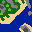

# Final Project Proposal

Sean (spduffy2) | Moderator: Shiven (shivenk2)

This is a "game" about creating a randomly generated world

## Abstract
### Project Purpose
The purpose of this project is to experiment with and learn about procedural generation. I will learn how to 
write a program that automatically generates "worlds", like what may exist in a video game, store and load them,
display them visually, and allow users to interact with them.

### Project Motivation
I have personally always found procedural generation to be very interesting. I played a lot of video games in middle
school and high school, and even now when I have time, and I've always found myself drawn to games where the world
you explore is generated programatically, instead of being perfectly pre-built. I have always wanted to try creating
something like that myself, and I think that this is a great opportunity to. 

## Technical Specification
- Platform: Windows App
- Programming Languages: Python
- Stylistic Conventions: Same as the python style guide used for assignment 2
- SDK: Python SDK
- IDE: PyCharm
- Tools/Interfaces: Pygame, NumPy
- Target Audience: Anyone who may be interested in it

## Functional Specification
### Features
- The ability to randomly generate a 2 - Dimensional, grid-like map from a seed
- A simple representation of sand, earth, water, and mountains (They only appear to be 3 Dimensional)
- The ability to save a map to a file and open that map up later (.npy format)
- Trees and flowers that are placed on the land in appropriate places
- The ability to display this map visually
- The user will be to "explore" the map (Move across the surface, zoom in and out)
- The ability to modify certain variables that control how the map is built, such as: how big oceans are, how quickly
  height changes, and how many trees there are through a config file (YAML)
- Trees grow taller over time
- The user will be able to modify the world in real time by "raising" and "lowering" terrain ("Raising" the terrain would 
  constitute turning oceans into flat land, flat land into mountains, etc. while "lowering" does the opposite)

Here is a Mock-up of what a map might look like when displayed visually: (Except much bigger, I forgot how pixel art works
when I made this)

### Scope of the project
- Limitations include that I am not much of an artist, so it may not be visually appealing. Maps will be finite and limited
to considerably smaller than I would like them to be. There will be no animations either, and there will not be GUI
functionality for the customization tools.
- Assumptions include that pygame will be able to handle rendering many different images at once. They also include that 
users will not go in and try to edit the save files manually.

## Brief Timeline
- Week 1: Implement the "model" part of the world for generating the map and representing the different surface types (i.e.,
water, sand, grass, and rock, but not trees or flowers) and the functionality for saving and loading maps.
- Week 2: Implement trees and flowers into the model, create a simple static visualization for maps, implement the ability to
zoom in, zoom out, and move in cardinal directions, and create the ability to read in YAML files to modify how the world is 
created.
- Week 3: Represent the map dynamically, allowing what is displayed visually to change over time. Create a representation of 
age and make trees grow older over time. Allow the user to modify the world by increasing or lowering the height of the terrain.
Save the changes to the file automatically, so that next time that file is opened the world keeps the changes.

## Rubrics
### Week 1
| Category  | Total Score Allocated | Detailed Rubrics                                                            |
|-----------|:---------:|-------------------------------------------------------------------------------|
|  Surface Types |  5  |  +1: There is some object to represent each grid square   +2 (0.25 each): At least 8 unique surface materials    +1: The surface materials share an abstract class structure and can be easily extended    +1: Hold values about their height |
|  Terrain Generator |  5  |  +1: Generation is seed based    +3: Grid squares are not independent, group together intuitively to form multi-square mountains, oceans and landmasses   +1: Generation of "height map" is independent of surface types |
|  Save to file |  3  |  +1: Used .npy format    +1: Can be specified with command line argument   +1: Saved file accurately represent the map created |
|  Load from file |  2  |  +1: Can be done form command line   +1: If a map is saved and then loaded back in, its representation in the code should be exactly the same |
|  Unit Tests |  10  |  +5: 0.5 per test case   +5: Line coverage |

Google Sheets link: https://docs.google.com/spreadsheets/d/1G5skOyliKs8TJ0K4gF-75Xu99VM3zTZsDu3SUgKWap0/edit#gid=1203283929

### Week 2
| Category  | Total Score Allocated | Detailed Rubrics                                                            |
|-----------|:---------:|-------------------------------------------------------------------------------|
|  YAML config files |  4  |  +1: Includes sample config file with default values   +1: Can modify overall scale of map   +1: Can modify rarity of individual elements   +1: Error handling when invalid entries are given |
|  Trees and Flowers |  2  |  +1: Trees and Flowers are represented in the code    +1: Trees and flowers only generate in places where it makes sense (on grass, not on water or rock) |
|  Static GUI |  5  |  +2: GUI accurately represents the map that is loaded   +1: All surface materials, as well as trees and flowers, have distinct visual displays   +1: Depth can be intuited from visual clues   +1: GUI has minimal interaction with backend model, the whole map should be loaded from a single object |
|  Camera Controls |  4  |  +1: Can zoom in and out   +1: Can move camera up, down, left and right (+0.25 each)   +1: Cannot zoom in so far as to only see a few grid squares, or out so far that nothing can be made out   +1: Cannot move the camera past the edge of the map |
|  Unit Tests |  5  |  +0.5 per unit test |
|  Manual Tests |  5  |  +1 per test, should cover all visual representations |

Google Sheets link: https://docs.google.com/spreadsheets/d/1qlP8uBLk88d5eu9ZoMhLQdX_rxQ5gJCABzr5mV-DzcY/edit#gid=1203283929

### Week 3
| Category  | Total Score Allocated | Detailed Rubrics                                                            |
|-----------|:---------:|-------------------------------------------------------------------------------|
|  Game Loop |  3  |  +1: The game loop is time based, not based on turns or framerate   +2: Controller functionality exists to keep the view and mode separate |
|  Terrain Modification |  4  |  +1: What happens when terrain is raised or lowered is determined by the surface height   +1: Terrain at the maximum or minimum height cannot be raised or lowered, respectively   +1: Trees and flowers die when the surface changes to be one they cannot survive on |
|  Aging Trees |  3  |  +1: Trees can be in multiple states, depending on age   +1: Trees progress through these states as in game time passes    +1: Tree age is saved and loaded with worlds |
|  More YAML config |  1  |  +1: YAML file can be configured to change how fast trees grow |
|  Player Control |  4  |  +1: Player can raise terrain with right click   +1: Player can lower terrain with left click   +1: Terrain changes are not just visual, they happen in the model as well   +1: Game is able to accurately detect what is clicked on |
|  Unit Tests |  5  |  +0.5 per unit test |
|  Manual Tests |  5  |  +1 per test, should cover all visual representations |

Google Sheets link: https://docs.google.com/spreadsheets/d/1wljImd4a1AGpBqm4cm84EiAcHIn80AspWkw4zLHArpQ/edit#gid=1203283929
